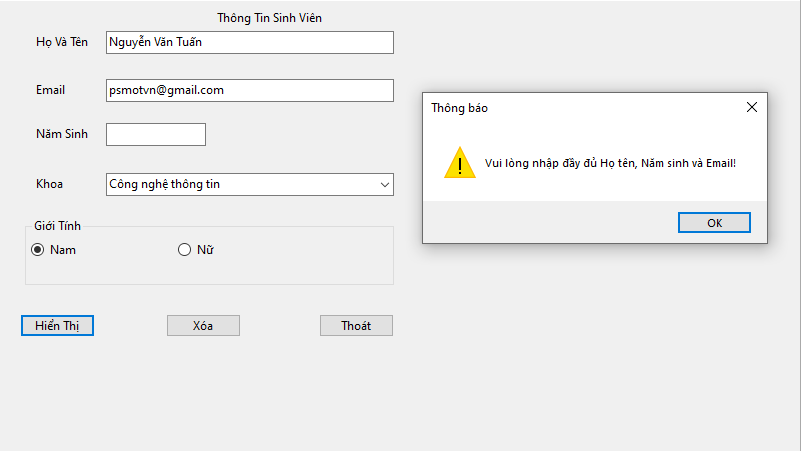
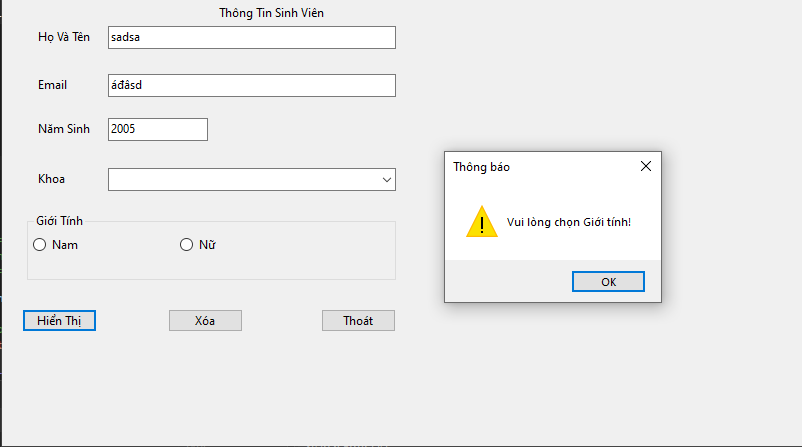
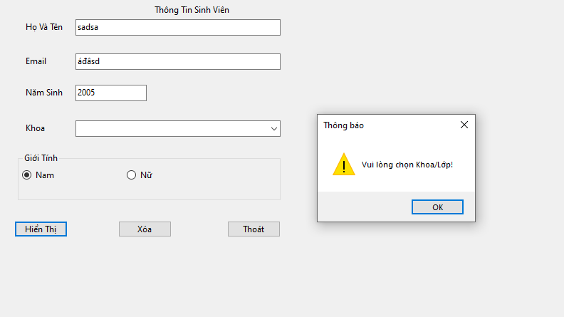
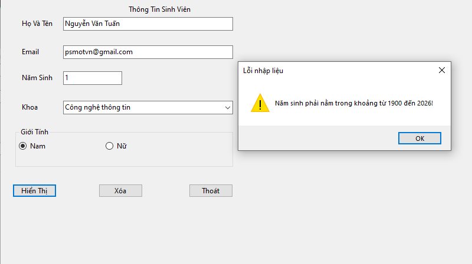
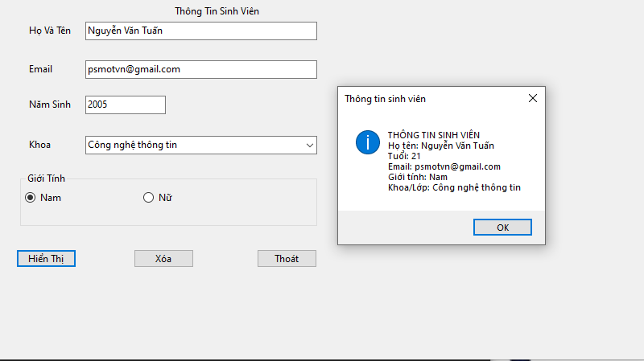
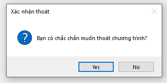

# Lab 01 - Ứng dụng thông tin cá nhân

**Sinh viên thực hiện:** Nguyễn Văn Tuấn

## Mô tả
Ứng dụng C# WinForms cho phép nhập, kiểm tra tính hợp lệ và hiển thị thông tin cá nhân cơ bản của sinh viên, đồng thời tích hợp tính năng tự động tính toán tuổi thực tế.

## Chức năng
- Nhập dữ liệu: Họ tên, Năm sinh, Email.
- Tự động tính toán và hiển thị ngay Tuổi khi người dùng nhập Năm sinh.
- Chọn Giới tính (Nam/Nữ) và Khoa/Lớp (từ danh sách xổ xuống).
- Bắt lỗi và cảnh báo khi bỏ trống thông tin (Họ tên, Email, Năm sinh, Giới tính, Khoa).
- Bắt lỗi khi nhập Năm sinh sai định dạng (nhập chữ) hoặc ngoài khoảng hợp lệ (1900 - năm hiện tại).
- Hiển thị thông báo tổng hợp thông tin sinh viên thành công.
- Xóa trắng toàn bộ dữ liệu trên form để nhập mới.
- Hiển thị hộp thoại hỏi xác nhận trước khi thoát chương trình.

## Công nghệ sử dụng
- C# WinForms
- .NET 8

## Cách chạy
1. Mở file `Lab01/Lab01.sln` bằng Visual Studio.
2. Build solution.
3. Nhấn F5 để chạy chương trình.

## Hình ảnh minh họa

### Cảnh báo khi bỏ trống Họ tên, Email, Năm sinh

### Cảnh báo khi chưa chọn Giới tính

### Cảnh báo khi chưa chọn Khoa/Lớp

### Cảnh báo khi Năm sinh không hợp lệ

### Hiển thị kết quả thành công

### Xác nhận thoát chương trình

